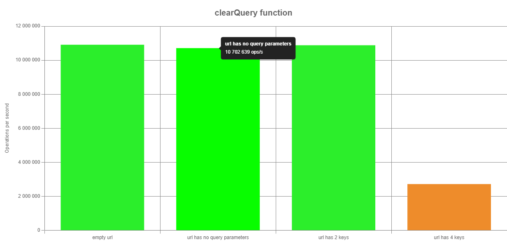
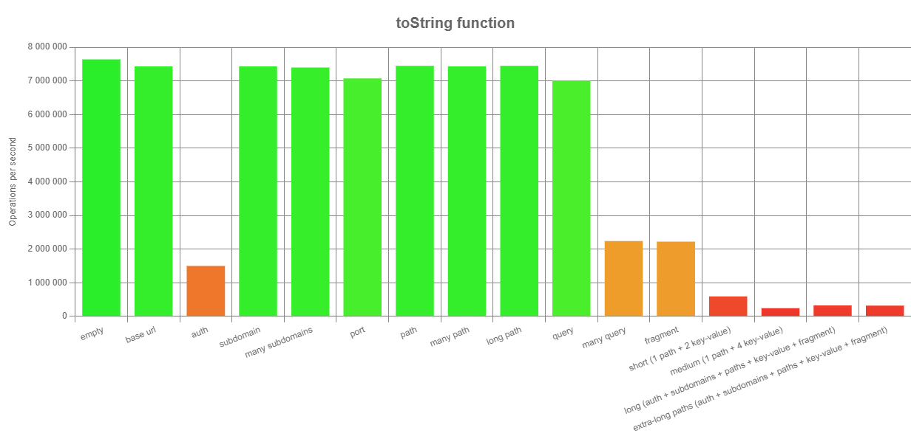
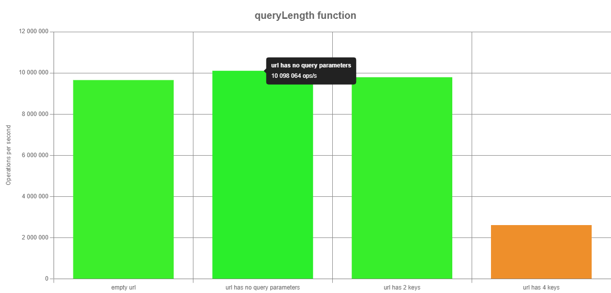
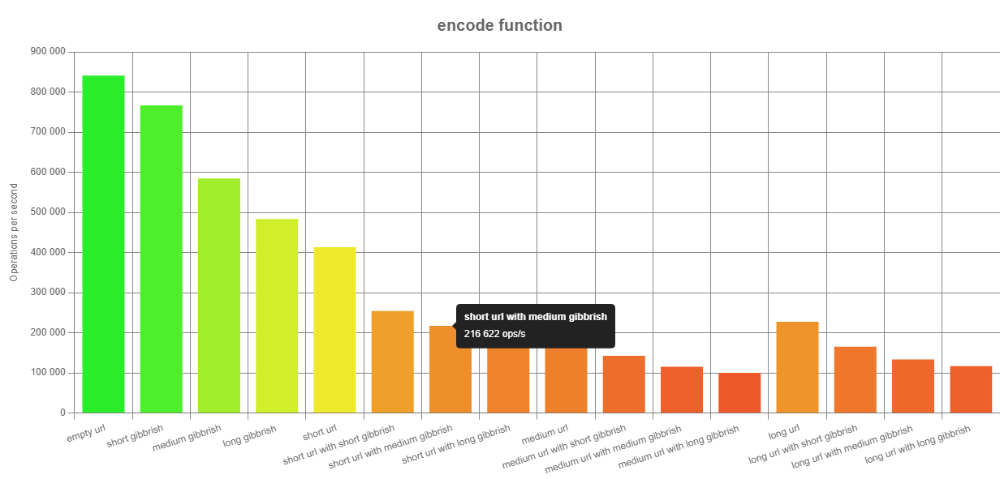

# Performance testing

## A feladat

Ebben a feladatban teljseítméy tesztek tervezése és végrahajtása volt a középpontban. A tesztek a _benny npm_ library felhasználásával készültek.

## Tervezés

- A tesztelő könyvtár megismerése, próba tesztek írása
- A proptotype függvények vizsgálata és a funkcióhalmaz kiválasztása
- A teszteléshez szükséges URL-ek megtervezése, encoding konvenciók megismerése
- A tesztek megtervezése és végrehajtása

## Eredmények

1. A clearQuerry function

Cél:

A clearQuerry függvény teljseítménye különböző hosszúságú bemeneteken, ismerkedés a _benny_ library-vel.

2. A toString function

Cél:

Megimserni, hogy a különböző URL paraméterek mennyire befolyásolják a toString függvény teljesítményét

3. A querryLength function

Cél:

4. Az encode function

Megismerni, hogy a querry paraméterek száma hogyan befolyásolja a querryLength függvény teljsítményét.

Cél:

Megfigyelni az encode function viselkedését nem ASCII karaktert tartalmazó URL-el paraméterezve és ugyanolyan hosszú csak ASCII karaktert tartalmazó URL-el.

## Tanulság

1. A _benny_ library könnyen hozzáadható a projecthez és kiváló környezetet biztosít a tesztek megírásához illetve az eredmény szemléltetésére. A függvény teljseítményét rontja az URL paraméter hossza. (@nudleee, @blu3berry-why)

2. A querry-k és a fragment-ek jelentősen visszaveszik a teljseítményt, a többi ezekhez képest elhanyagolható. (@blu3berry-why)

3. A függvény elvárt módon viselkedett: az URL hosszával romlott a teljseítmény.(@blu3berry-why)

4. Az encode függvény teljseítményét sokkal nagyobb mértékben rontja az URL hossza, mint a nem ASCII karakterek száma. (@nudleee)
